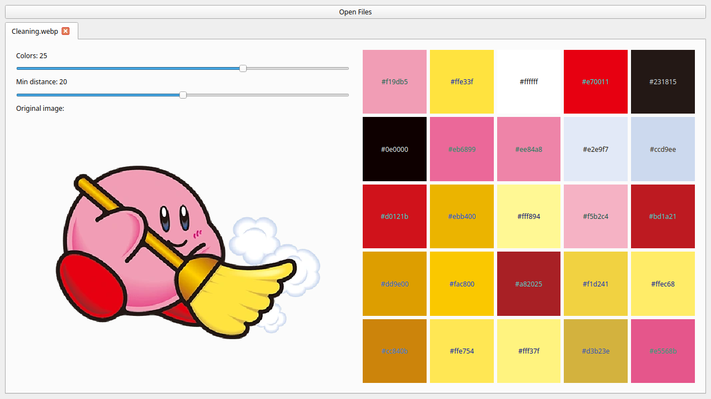

# palette-helper
A small Python utility to help extract a palette from images.

## Dependencies
palette-helper uses the following pip packages. You can install them yourself or use `pip install -r
requirements.txt` to have pip install them all at once. The `requirements.txt` file uses PyQt6, but
PyQt5 should also work (I think).

- PyQt5/6
- Pillow

## Usage
The following screenshot shows the layout of palette-helper:

Use the button to open a file dialog to select the images you want to pull a palette from. You can
select multiple images of several different kinds. You can control the number of colors you want to
extract and the minimum "distance" they should be from each other on the side.

Each image is opened in a separate tab with the controls and a reference to the image on the left.
The controls apply to each tab, so you can have diffferent settings for each image you have open.
You can click the color squares in the grid to copy that color value to your system clipboard.

## Reporting Bugs/Issues
This is only meant to be small tool for me that I thought others might want to use, so I haven't
really planned to invest that much time into developing it. All the same, feel free to open an issue
if you find anything wrong that you'd like me to take a look at. The fact that you used this tool at
all is very flattering.

## Known Issues
Currently when opening an image, the program precalculates all the palettes for all the different
tuples of the number of colors and the minimum distances between them. This makes it very slow to
start up, but once it has crunched all that data, updates to the UI are pretty much instantaneous.
For now it's good enough for my needs with it, but I would like to improve the performance of this
app a little bit.

## TODO (someday)
- Improve app performance
- Add option to export all colors in a palette at once
- Add UI to assign colors to a theoretical palette and show a preview of that palette for different
  contexts, such as:
  - Terminal colorscheme
  - vim colorscheme
  - Emacs colorscheme
  - etc
